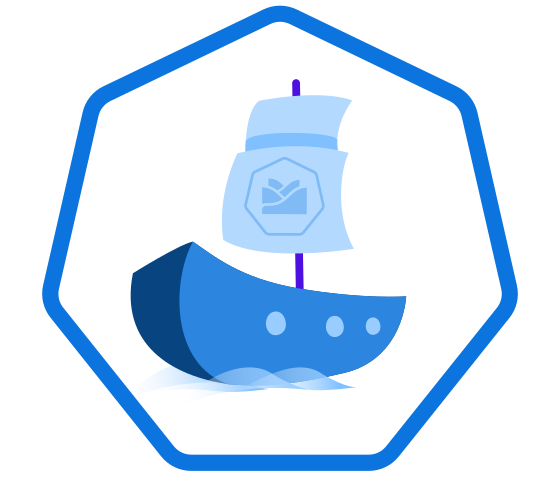

 

# Varkes

## Overview

Varkes (Greek for “small boats”) is a framework which mocks applications. This "small boat" allows you to mock even a complex application (a "big ship") and develop your functionality in an easy way. Instead of setting up and deploying an often complex application, you simply pair the mock with Kyma to develop and experiment with it. When you are done, simply switch the "ships" to connect to and work with the target application. 

Varkes framework provides the following node modules to make the application mocks work:

* **Api Server** used to pair with the Kyma cluster to register Events and APIs and send Events. For details, see [Api Server](api-server/README.md).

* **OpenAPI mock** which mocks the application APIs based on the OpenAPI specification. For details, see [OpenAPI mock](openapi-mock/README.md).

* **Odata mock** which mocks the application APIs based on the OData specification. For details, see [OData mock](odata-mock/README.md).

## Architecture

The diagram shows how an application mock integrates with a Kyma cluster and which functionality is taken over by which framework modules:

## Examples

The `examples` folder includes mocks based on OpenAPI and OData packages. 
>**NOTE:** Using examples in the `master` branch without cloning the repository is currently impossible because of the development version numbers used in the `package.json` files which are not published to the npm registry. If you want to use the examples without cloning the whole repository, use the tags in the `release` branch. There you can find the latest version of the dependencies already included in the `package.json` files. 

To create Docker images of examples, use the `release` branch, where the npm installed in Docker containers can get the latest version from the registry.

## Development

This project is maintained by Lerna. To start developing perform these steps:

1. If you don't have lerna, install it by running `npm install -g lerna`.
2. Clone this repo and run `make resolve` in the project root to install dependencies and link local dependencies.
3. Introduce your changes and commit freely. There is no need to update the package versions in dependent subprojects.

To increase the version number, run `lerna version --no-git-tag-version`, stating the new version number. When omitting the flag, it also creates a new git tag with the given version number. This command also updates the dependency version in the `package.json` of subprojects.

To see how CI operates on Lerna, check the makefile in the root folder.
