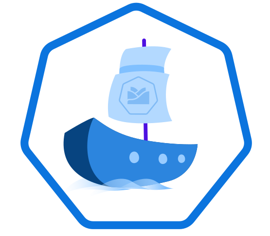

<p align="center">
 
</p>

# combined-openapi-mock example

This example illustrate how to use the `varkes-openapi-mpck` in combination with the `varkes-app-connector-client`.

## Run local

To run it local run:
```
npm install
npm start
```

Navigate to `http://localhost:10000` to see the UI of the `app-connector-client`.
Navigate to `http://localhost:10000/console` to see the console of the `app-connector-client`.
Navigate to `http://localhost:10000/api1/console` to see the console of the `courses` api.
Navigate to `http://localhost:10000/api2/console` to see the console of the `schools` api.

## Run local using docker

To run it using docker, call:
```
docker run -p 10000:10000 eu.gcr.io/kyma-project/incubator/varkes-example-combined-openapi-mock:latest
```

## Run in Kyma

To run the mock using Kyma as runtime envrironment, run the following kubectl command to set up a namespace:

```bash
kubectl create namespace mocks
kubectl label namespace mocks env=true
```

and to deploy the mock
```bash
kubectl apply -n mocks -f https://raw.githubusercontent.com/kyma-incubator/varkes/master/examples/combined-openapi-mock/deployment/deployment.yaml
```